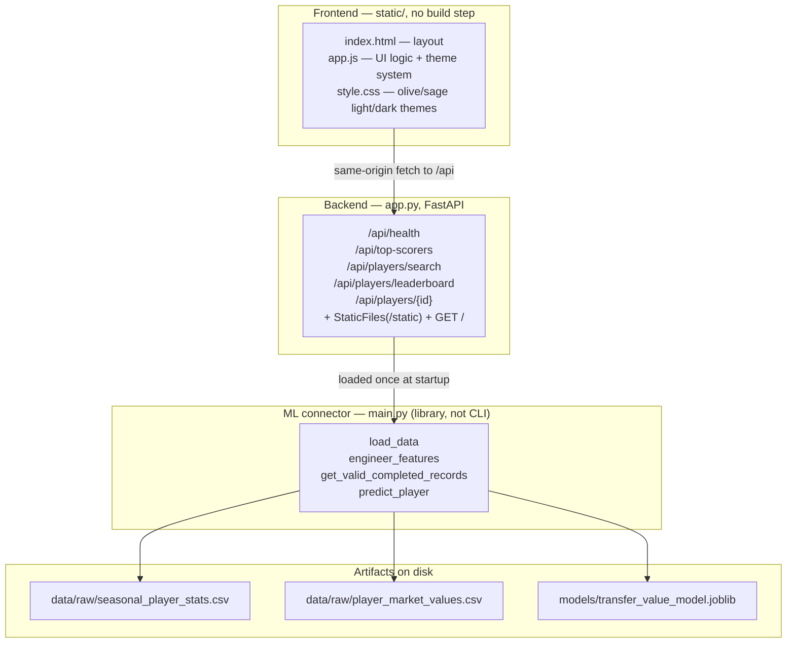
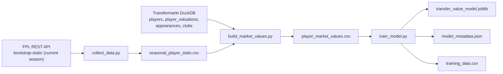

# System Architecture — Full-Stack Transfer Value Predictor

How the web UI, API backend, ML connector, and offline data pipeline fit together.


---

## 1. What the system does

The system learns a statistical baseline mapping on-pitch output to Transfermarkt market value.

It then serves that baseline as a searchable web app: sortable player rankings, individual player profiles with photos and club badges, predicted-versus-actual verdicts, and actual-vs-predicted comparison charts for up to 5 players.


---

## 2. Big picture

There are two halves that never mix at runtime: an **offline training pipeline** that produces CSVs and a saved model, and an **online web app** that loads those artifacts once and answers requests.

### 2.1. Runtime (what serves the browser)



### 2.2. Offline training (what produces the artifacts)



Key discipline: `main.py` never trains, and `app.py` never retrains per request. Training happens once offline; serving only loads.


---

## 3. Frontend in detail (`static/`)

Vanilla HTML, CSS, and JavaScript. No framework, no bundler, no build step — the files are served as-is by FastAPI. All API calls are same-origin under `/api`, so the UI only works when served by the backend.

CDN dependencies (the UI needs network access for these):

- Lucide icons (`unpkg.com/lucide@latest`)

- Chart.js (`cdn.jsdelivr.net/npm/chart.js`)

- Inter font (Google Fonts)

### 3.1. `index.html` — layout

The page is a single dashboard with four areas:

- **Navbar.** Logo button (returns home) plus a search box with an autocomplete dropdown.

- **Top-scorers marquee.** Hidden by default; shown on the home view. A horizontally auto-scrolling strip of clickable player cards (photo, name, team badge, goals/assists/apps).

- **Leaderboard section.** Sort dropdown, segmented Highest/Lowest tabs with sliding pill, skeleton placeholders, the ranking list itself, a terminal error state, and a "Show 10 More" pagination button. Unknown actual values render as `Unknown` (never `£0`) and sort last in both directions.

- **Profile section.** A morphing dialog overlay (no page transition): FLIP-expands from the clicked row/card, closes on backdrop/Escape with focus restore, reduced-motion safe. No Back button. Contents: photo button (opens an enlarged FLIP lightbox, fallback-safe), name, club badge, team/position/season meta, APPS/MINS/GOALS/ASSISTS strip, Actual vs Predicted valuation cards, and an "Add to Comparison" button with morphing label.

- **Comparison section.** Hidden until at least one player is added. Tag chips per player, an in-section Search Player popover (same search API, 5-player cap enforced), a "Clear All" button, and a Chart.js canvas with theme-aware colors and null-gap lines.

### 3.2. `app.js` — UI logic

State held at module level:

- `comparisonList` — players added to the chart (capped at 5).

- `chartInstance` — the live Chart.js object (destroyed and rebuilt on change).

- `searchTimeout` — debounce timer for the search box (~300 ms).

- `currentPlayer` — the profile currently on screen.

- Leaderboard paging state: `lbSortBy`, `lbOrder`, `lbOffset`, with `INITIAL_LIMIT = 5` rows first and `PAGE_LIMIT = 10` per "Show More".

Behaviour per area:

- **Search.** Fires only for queries of 2+ characters. Renders dropdown rows with photo, name, and team. Empty results show "No player found." Clicking a row clears the box and loads that profile.

- **Marquee.** Fetches `/api/top-scorers`, keeps the first 7, renders each card twice so the CSS scroll loop is seamless. Cards click through to the profile.

- **Leaderboard.** Fetches `/api/players/leaderboard` with the current sort, order, limit, and offset. Sort keys: `market_value`, `alphabetical`, `appearances`, `minutes`, `assists`, `goals`. The primary stat column follows the active sort; market value stays visible as the secondary column otherwise. Ranks 1–3 get a highlighted style.

- **Profile.** Fetches `/api/players/{id}` and renders into the dialog. Photos fall back to an inline SVG avatar on error (the enlarged lightbox reuses the same source); club badges hide themselves on error. When `has_valid_season` is false, stats and valuation cards are hidden and an explanatory warning is shown instead. Market-value states are explicit: unknown actuals are `null` + `"unknown"` status, unavailable predictions are `null` + `"unavailable"`.

- **Valuation verdict.** Rendered only when `comparison_available` is true. Difference = predicted − actual, shown as £ plus percentage, labelled Overestimated / Underestimated / Exact match with a trending-up / trending-down / minus icon.

- **Comparison.** Players can be added from a profile or the in-section search (valid season required, duplicates and a full 5/5 list blocked). Tags are removable; clearing all hides the section and empties the tag DOM. The chart plots two lines — Actual (accent) vs Predicted (primary) — with a £M y-axis and GBP tooltips, repaints on theme change, and degrades gracefully if the Chart.js CDN is blocked.

### 3.3. `style.css` — theme

Light/dark themes driven by an explicit `data-theme` attribute (manual toggle, `localStorage`, Light default, pre-paint script prevents flashing). Olive/sage palette expressed as five scales (`text`, `background`, `primary`, `secondary`, `accent`) plus derived semantic variables; no page-wide gradients. Includes the segmented-tab pill, morph-dialog overlay/sheet, photo lightbox, bottom dock, comparison search popover, skeleton shimmer, and responsive breakpoints (plus a ≤480 px single-figure row rule). `prefers-reduced-motion` stills the marquee, shimmer, trails, and morphs.


---

## 4. Backend in detail (`app.py`)

One FastAPI process does two jobs: it serves the JSON API **and** hosts the frontend files.

- **Static hosting.** `StaticFiles(directory="static")` mounted at `/static`; `GET /` returns `static/index.html` with `?v=<mtime>` cache-busting query strings injected into the asset URLs. The `static/` directory is created if missing (`os.makedirs`).

- **CORS.** Fully open (`allow_origins=["*"]`, all methods and headers).

- **Startup.** The `startup_event` handler (deprecated `@app.on_event` style) loads the full merged dataset into the global `DATASET` and the trained pipeline into the global `MODEL` via `main.py` helpers — once, not per request. Failures are printed and leave the globals as `None`, which makes every data endpoint return HTTP 500.

- **NaN hygiene.** `clean_nan` converts pandas/NaN missing values to `None` so every response is valid JSON. `record_to_dict` projects one DataFrame row to the public player shape (identity, team, position, season, photo — `None` when upstream has no headshot — club badge, totals, market value, FPL fields). `with_valuation_states` adds `actual_market_value_status`, `prediction_status`, and `comparison_available`; sorting uses a separate key so unknown market values are never zero-filled.

- **Club badges.** Resolved from `transfermarkt_club_id` via the Transfermarkt CDN (`tmssl.akamaized.net/images/wappen/head/{id}.png`); falls back to the FPL team badge URL when no Transfermarkt ID exists.

### 4.1. Endpoints

- `GET /api/health` — liveness probe. Returns `{status, data_loaded, model_loaded}`.

- `GET /api/top-scorers` — filters to valid completed-season records, takes the latest season, returns the top 15 by `total_goals`. The frontend displays the first 7.

- `GET /api/players/search?q=` — returns `[]` for queries under 2 characters. Delegates matching to `main.find_player`, de-duplicates by `player_id`, and returns at most 10 light rows (`player_id`, `player`, `team`, `photo_url`).

- `GET /api/players/leaderboard?sort_by=&order=&limit=&offset=` — de-duplicates to one row per player (latest season first), sorts by the requested key (`market_value`, `alphabetical`, `appearances`, `minutes`, `assists`, `goals`; anything else falls back to market value) with unknown actuals last, slices by offset/limit, and attaches each row's `predicted_value_gbp`, valuation statuses, and `has_valid_season: True`. Returns `{total, offset, limit, players}`.

- `GET /api/players/{player_id}` — filters the dataset to that player's history, picks the latest valid completed season, and returns the full record plus prediction and valuation statuses. Returns 404 for unknown IDs. When the player has no valid completed season with a market value, returns the raw row with `has_valid_season: False` and a null prediction instead of failing.


---

## 5. ML connector in detail (`main.py`)

`main.py` is a shared library, not a CLI runner. It owns every data/ML primitive both the API and the training script use. Its public surface:

- `scale_target` / `inverse_scale_target` — ÷1e6 / ×1e6 target transform, defined here (importable module) so the pickled pipeline loads from any entry point.

- `FEATURE_COLUMNS` — `["position", "team", "age", "fpl_minutes", "goals_p90", "assists_p90", "clean_sheets_p90", "saves_p90"]`, the exact schema the model was trained with.

- `engineer_features(df)` — parses season years, derives `age` from `date_of_birth` (median fallback 25.0), coerces numerics (missing → 0), and adds per-90 rates from FPL columns.

- `load_data()` — reads `player_market_values.csv` and backfills `"Unknown"` team names from `val_club_name` where available.

- `load_model()` — loads `transfer_value_model.joblib`, falling back to the identical `.pkl` copy; logs and returns `None` on failure instead of raising.

- `find_player(df, query)` — Unicode-normalised exact/known-name/substring match plus a token-subset fallback (e.g. "bruno fernandes" → "bruno borges fernandes").

- `get_valid_completed_records(df)` — numeric-coerces market values and sorts newest season first. Note: it does **not** filter out missing values — unknown-MV rows flow through and are handled as explicit `Unknown` states downstream.

- `predict_player(model, record)` — engineers one row and returns `float(model.predict(...)[0])` floored at 0, or `None` when no model is loaded or prediction fails (the error is printed, not swallowed silently).


---

## 6. Offline pipeline in detail

### 6.1. Step 1 — `collect_data.py` (FPL harvest)

- Reads `bootstrap-static` for the current-season roster (667 players), team names/codes, positions, and live FPL prices. No historical seasons, no `element-summary` calls.

- Synthesises stable identifiers per player: Premier League photo URLs (`resources.premierleague.com/.../p{code}.png`, using the FPL `code` identifier) and FPL club badge URLs (`.../badges/t{team_code}.png`).

- Validates every headshot against the PL CDN (threaded HEAD requests); genuinely missing photos (new signings, youth players — 271 of 667) are stored as `null` so the UI shows the neutral placeholder instead of a broken image.

- Writes `data/raw/seasonal_player_stats.csv`.

### 6.2. Step 2 — `build_market_values.py` (entity resolution + valuations)

- Opens the local Transfermarkt DuckDB read-only and pulls `players` (with peak EUR value), `player_valuations` (joined to `clubs` for name + ID), and `appearances`.

- Normalises names (Unicode NFKD → ASCII, lowercase, strip non-letters, drop particles like `de`, `van`, `dos`) into token sets.

- Matches each FPL player to a Transfermarkt ID: FPL tokens must be a full subset of TM tokens, or overlap ≥ 60%. Candidates are scanned in peak-value order, so the first hit wins — the world-class entity breaks ties between same-name players. Current run: 593 matched, 74 unmatched (mostly promoted-club squads absent from the snapshot, plus a few transfer-lag false negatives).

- Maps valuation/appearance dates to seasons with the same July cutoff, keeps the latest valuation per (player, season), converts EUR → GBP (`× 0.86`), and sums all-competition appearances/minutes/goals/assists per (player, season). Rows with no exact-season valuation fall back to the player's overall-latest Transfermarkt value; players with no TM identity keep `null`.

- Writes `data/raw/player_market_values.csv` with market values, club IDs/names, and Transfermarkt aggregates.

### 6.3. Step 3 — `train_model.py` (training)

- Loads data through `main.load_data()` + `main.engineer_features()`, keeps positive-value rows (564), and splits with a seeded random 80/20 `train_test_split` (`random_state=42`) — deterministic, but a single-season split, not a temporal evaluation.

- Pipeline: `OrdinalEncoder` (unknown-safe) on `position` + `team`, passthrough numerics, → `HistGradientBoostingRegressor(loss="poisson", learning_rate=0.05, max_iter=300, min_samples_leaf=15)` → wrapped in `TransformedTargetRegressor(func=main.scale_target, inverse_func=main.inverse_scale_target)`. Importing (not redefining) the transform functions is what makes the pickle loadable outside the training process.

- Prints MAE/RMSE/R² plus median error/bias (current: MAE £8.1M, RMSE £12.4M, R² 0.44, MdAPE 34.0%).

- Saves `models/transfer_value_model.joblib` **and** an identical `models/transfer_value_model.pkl`, regenerates `models/model_metadata.json` (features, transform, metrics) and a zero-missing `models/training_data.csv` snapshot.

### 6.4. Diagnostics — `diagnose_prediction.py`

Single-player end-to-end check: load data, find the player, take the latest valid completed record, load the model, print Transfermarkt ID, season, club, actual vs predicted. Uses the same `main` helpers as the API.


---

## 7. Data artifacts and schema

- `data/raw/seasonal_player_stats.csv` — one row per current-season FPL player (667): IDs, names, team, position, season, FPL stat columns (`fpl_minutes`, `fpl_goals`, `fpl_assists`, `fpl_clean_sheets`, `fpl_goals_conceded`, `fpl_saves`), FPL price, photo/badge URLs (`photo_url` null when the PL CDN has no headshot).

- `data/raw/player_market_values.csv` — the above plus `tm_player_id`, `date_of_birth`, `market_value_gbp` (null for 103 rows: 74 unmatched identities + 29 matched-but-unvalued), `val_club_id` / `val_club_name`, `transfermarkt_club_id`.

- `models/transfer_value_model.joblib` + `models/transfer_value_model.pkl` — identical fitted pipelines (preprocessing + regressor + ÷1e6 target transform).

- `models/training_data.csv` — 564-row snapshot of the exact training frame (zero missing values).

- `models/trained_model.pkl` — stale legacy artifact (old LinearRegression dict); unused, kept only for reference.

- `models/model_metadata.json` — model type, feature lists, target transform, training-row count, and metrics for the record.

- `transfermarkt-datasets.duckdb` — local source of truth for valuations and appearances (git-ignored, ~200 MB).


---

## 8. Technology stack

| Layer | Technology | Role |

| :--- | :--- | :--- |

| Frontend | Vanilla HTML / CSS / JS | No framework, no build output |

| Frontend | Chart.js (CDN) | Actual-vs-predicted comparison chart |

| Frontend | Lucide (CDN) | Icons |

| Frontend | Inter via Google Fonts (CDN) | Typography |

| Backend | FastAPI | API + static hosting in one process |

| Backend | uvicorn | ASGI server (`uvicorn app:app`) |

| Backend | pandas | Dataset handling and record projection |

| ML | scikit-learn | `HistGradientBoostingRegressor`, `OrdinalEncoder`, `ColumnTransformer`, `TransformedTargetRegressor` |

| ML | joblib | Model serialisation |

| ML | NumPy | Per-90 math and target transform |

| Data | FPL REST API | Rosters, seasonal stats, photos |

| Data | Transfermarkt DuckDB | Valuations, appearances, clubs |

| Data | CSV cache in `data/raw/` | No redownload on every run |

| Tests | pytest | `tests/test_basic.py` |


---

## 9. Key request flows

### 9.1. Searching for a player

1. User types ≥ 2 characters; the frontend debounces ~300 ms.

2. `GET /api/players/search?q=...` → `main.find_player` → up to 10 light rows.

3. Dropdown renders photo, name, team.

4. Click clears the box and calls `loadPlayer(player_id)`.

### 9.2. Viewing a profile

1. Clicking a row, marquee card, or search result calls `loadPlayer(id, triggerElement)`.

2. `GET /api/players/{id}` → latest valid record + prediction; the morphing dialog overlay expands from the trigger rect (backdrop/Escape close, focus restored).

3. Photo, badge, meta, stats strip, and valuation cards render; skeleton hides. The photo button opens an enlarged FLIP lightbox reusing the same source.

4. Failures show the error state instead.

### 9.3. Browsing the leaderboard

1. On boot, the frontend requests 5 rows sorted by market value, descending.

2. Changing sort/order resets the offset and re-fetches.

3. "Show 10 More" appends the next page until `offset >= total`, then hides.

### 9.4. Comparing players

1. "Add to Comparison" (with morphing label states) or the in-section Search Player popover adds the player (max 5, no duplicates, valid season required).

2. Tags render with remove buttons; "Clear All" empties the list, clears the tag DOM, and hides the section.

3. The Chart.js instance is destroyed and rebuilt with Actual and Predicted series; it repaints on theme change and skips rendering (tags still work) if the CDN is blocked.


---

## 10. What the model captures — and what it does not

```
┌────────────────────────────────────────────────────────────────────────┐
│                        TRANSFER VALUE DRIVERS                          │
├───────────────────────────────────┬────────────────────────────────────┤
│   Captured by this model          │   Real-world context (uncaptured)  │
├───────────────────────────────────┼────────────────────────────────────┤
│ ✓ Goals and assists (incl. p90)   │ ✗ Contract duration remaining      │
│ ✓ Minutes (age derived from DoB)  │ ✗ Release clauses                  │
│ ✓ Clean sheets, saves             │ ✗ Age trajectory                   │
│ ✓ Position + club stature (team)  │ ✗ Injury and medical history       │
│ ✓ Single-season consistency       │ ✗ Commercial and marketing appeal  │
│                                   │ ✗ Tactical defensive actions       │
└───────────────────────────────────┴────────────────────────────────────┘
```

Takeaway: an analytical decision-support baseline for spotting statistical over/under-valuation — not financial or transfer advice.


---

## 11. Known gaps and boundaries

- Single-season training: the dataset holds only the in-progress 2026-27 season, so the 80/20 split is not a temporal evaluation and predictions move as statistics accumulate.

- Identity recall: 74 unmatched players and 29 matched-but-unvalued rows have no actual value (explicit `Unknown`, predictions still served); 271 players lack upstream headshots (explicit `null`, placeholder shown).

- `models/trained_model.pkl` is a stale legacy artifact and `src/*/`, `notebooks/`, `data/processed/` are empty scaffolding kept for structure.

- The UI depends on CDN access (Lucide, Chart.js, fonts); icon/chart failures are isolated so core rendering survives, but the full experience needs network.

- `package.json` is an empty `{}` placeholder; there is no frontend build step.

- `production.md` describes a future MLOps target (orchestration, registry, Redis, Kubernetes). It is aspirational — the current system is a single local process (note the stale `main.py`-CLI and `log1p` references there; the real pipeline is a `main.py` library with a ÷1e6 target transform).
